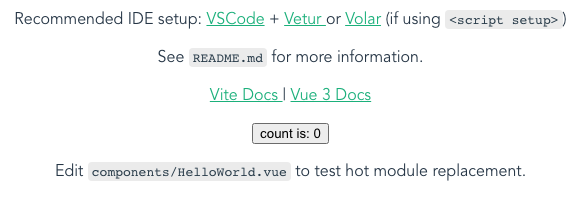

# Demo博文tag12

您好，这是一篇 Demo 文章，可以测试并实验以下功能：

# 一级标题

## 二级标题

### 三级标题

#### 四级标题

##### 五级标题

###### 六级标题

> 引用:
>
> 引用字符

[链接](https://baidu.com)

图片：



- 无序列表1
  - 无序子列表1
    - 无序子列表11
- 无序列表2
  - 无序子列表2

1. 有序列表1
   1. 有序子列表1
      1. 有序子列表11
2. 有序列表2
   1. 有序子列表2

代码区块：

```javascript
var a = 1;
const aa = 1;
function aaa () {}
```
`原始字符`

**加粗字符**

~~删除字符~~

*斜放字符*

<span style="color: red">自定义标签写法</span>
